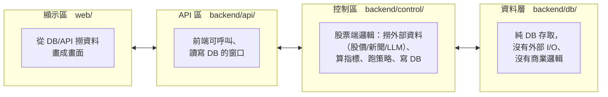

# 架構說明：顯示區 / 控制區 / API 區

這份文件的目的：讓你在「哪裡壞掉了」的時候，能直接說「去看 XXX 檔案」，
而不是「幫我修好」。

## 三層心智模型



- **顯示區**（`web/`）：畫面怎麼呈現。只呼叫 API，不直接碰資料庫、不含商業邏輯。
- **API 區**（`backend/api/`）：FastAPI 路由。只做「解析 request → 呼叫控制區/資料層 → 組回應」，
  刻意保持很薄——路由檔案本身不應該出現抓外部資料或計算指標的邏輯。
- **控制區**（`backend/control/`）：實際做事的地方。撈外部股價/新聞、跑本機 LLM、算技術指標、
  跑策略/回測，並透過資料層寫入 DB。背景排程（`scheduler.py`）也在這裡，
  它會在沒有使用者操作的情況下自己觸發控制區邏輯。
- **資料層**（`backend/db/portfolio_db.py`）：唯一碰 PostgreSQL 的地方。不屬於顯示區、控制區或
  API 區任何一邊，是三者都可能呼叫的共用層（API 區讀取來顯示、控制區寫入來記錄）。

## 目錄結構

```
web/                                    ── 顯示區 ──
  index.php                             頁面骨架、導覽列、各分頁容器 div
  static/js/
    core.js                             全域狀態、showPage/switchTab 路由、共用小工具
    pages/
      home.js                           首頁：股票列表 + 執行狀況列表
      stock-detail.js                   個股分析頁：圖表/技術/基本面/新聞
      ai-analysis.js                    個股分析頁：AI 分析分頁
      backtest.js                       個股分析頁：單股回測分頁
      settings.js                       策略設定頁
      scan.js                           今日訊號掃描頁
      market.js                         全市場篩選頁
      chat.js                           問股票聊天頁

api/backend/
  main.py                                ── API 區組裝點 ── app 建立 + include_router，無路由邏輯
  api/                                   ── API 區 ──
    stocks.py        股票列表 / 個股技術+基本面 / 新聞 / AI 分析
    chat.py           問股票聊天
    backtest.py       單股回測
    scan.py           今日訊號掃描
    market.py         全市場篩選
    settings.py       策略/系統設定
  control/                               ── 控制區 ──
    scheduler.py      背景排程：每小時檢查新交易日，自動觸發下面幾個模組
    data/fetcher.py   股價、基本面抓取與快取（含全市場批次報價/估值）
    data/price_store.py  全市場每日行情：每個交易日抓兩次存進 DB，個股歷史從 DB 讀
    data/news.py      個股相關新聞搜尋（SearXNG）
    analysis/technical.py  技術指標計算
    llm/ollama_client.py   Ollama 傳輸層
    llm/analysis.py        AI 個股分析：prompt、正規化、快取、二次驗證
    llm/chat.py             問股票聊天邏輯
    llm/react.py            AI 分析與聊天共用的流程積木（LLM 步驟、延伸搜尋迴圈）
    strategy/signals.py     買賣訊號、單股回測
    strategy/scanner.py     今日訊號掃描
    strategy/ai_batch.py       批次 AI 分析（只分析買進/賣出候選）
    strategy/market_screener.py  全市場篩選頁：對篩選後子集現算技術指標（KD等）與基本面（毛利率/EPS/ROE）
  db/                                     ── 資料層（共用，不屬於任何一區）──
    portfolio_db.py   PostgreSQL 存取層
    schema.sql
  config.py            settings.json 讀寫（API 區與控制區共用的系統設定）
  cache.py             本機 JSON 檔案快取（股價、新聞、AI 分析共用）
  utils.py             交易日曆／時區（共用小工具）
```

## 功能 × 檔案對照表

| 功能 | 顯示區（前端） | API 區 | 控制區 | 資料層 |
| --- | --- | --- | --- | --- |
| 首頁股票列表 | `pages/home.js` | `api/stocks.py`（`GET /api/top100`） | `control/data/fetcher.py` | — |
| 首頁執行狀況列表 | `pages/home.js` | `api/scan.py`（`GET /api/scan/calendar`） | — | `db/portfolio_db.py`（run_log） |
| 個股技術/基本面 | `pages/stock-detail.js` | `api/stocks.py`（`GET /api/stock/{ticker}`） | `control/data/fetcher.py` + `control/analysis/technical.py` + `control/strategy/signals.py` | — |
| 個股新聞 | `pages/stock-detail.js` | `api/stocks.py`（`GET /api/stock/{ticker}/news`） | `control/data/news.py` | — |
| 個股 AI 分析 | `pages/ai-analysis.js` | `api/stocks.py`（`POST /api/stock/{ticker}/ai-analysis`） | `control/llm/analysis.py` + `control/data/fetcher.py` + `control/data/news.py` | — |
| 問股票聊天 | `pages/chat.js` | `api/chat.py` | `control/llm/chat.py` | — |
| 單股回測 | `pages/backtest.js` | `api/backtest.py`（`POST /api/backtest/{ticker}`） | `control/strategy/signals.py` | — |
| 今日訊號掃描頁（讀取＋手動重試） | `pages/scan.js` | `api/scan.py` | `control/strategy/ai_batch.py`（重試邏輯） | `db/portfolio_db.py`（掃描結果快取） |
| 全市場篩選（TWSE+TPEX 全市場清單 + 子集技術指標/基本面） | `pages/market.js` | `api/market.py` | `control/data/fetcher.py`（全市場批次報價/估值） + `control/strategy/market_screener.py`（子集技術指標 KD 篩選 + 子集基本面毛利率篩選） | — |
| 背景自動掃描（非使用者觸發，每小時） | — | — | `control/scheduler.py` → `strategy/scanner.py`、`strategy/ai_batch.py` | `db/portfolio_db.py` |
| 策略設定頁 | `pages/settings.js` | `api/settings.py` | `backend/config.py`（讀寫 `api/config/settings.json`） | — |

## 除錯指引

1. **畫面顯示錯誤/樣式問題**：先查對照表找到「顯示區」對應的 `pages/*.js`，不用往下查。
2. **資料錯誤、過期、或抓不到**：查對照表的「控制區」欄位——多半是外部資料源
   （`control/data/fetcher.py`、`control/data/news.py`）或計算邏輯
   （`control/analysis/`、`control/strategy/`）出問題。
3. **按了按鈕沒反應、回傳 4xx/5xx**：查「API 區」欄位的路由檔案——這裡只做參數解析與呼叫，
   邏輯本身通常沒問題，但可以先確認 request/response 格式是否對得上前端呼叫。
4. **今日訊號掃描 / AI 分析結果一直沒更新**：這是背景排程（`control/scheduler.py`）觸發的，
   不是使用者操作觸發——查排程有沒有跑起來（`db/portfolio_db.py` 的 `run_log` 資料表），
   而不是查 API 路由。

## 資料表初始化

`db.init_db()`（建立資料表，idempotent）在 `main.py` 的 startup 事件裡呼叫，
所以 API 啟動時需要 DB 連得到、且有正確的資料庫設定（環境變數或 `settings.json`），
否則會在啟動階段失敗。
