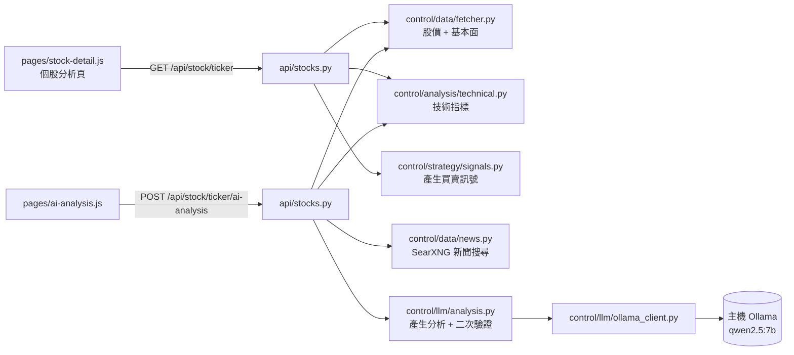
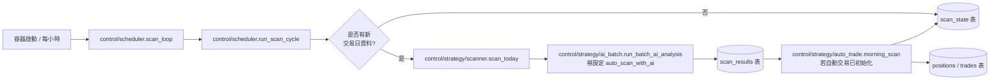
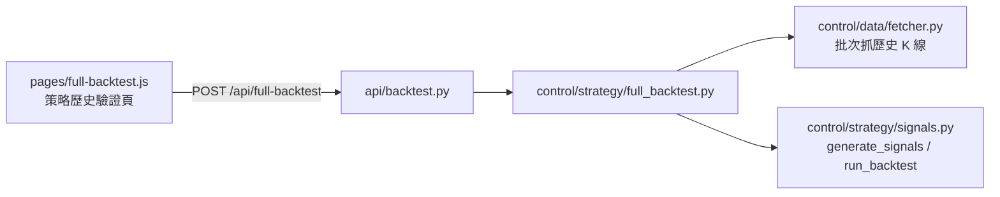
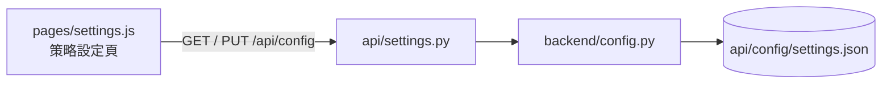

# 台股分析系統

以技術指標 + 規則式策略為核心的台股分析與模擬交易系統。提供個股技術/基本面分析、單股與全組合歷史回測、今日訊號掃描，以及全自動的模擬交易（紙上交易）。

> ⚠️ 本系統為學術研究用途，所有訊號與回測結果僅供參考，不構成投資建議。投資有風險，入市需謹慎。

## 功能

- **個股分析**：技術指標（RSI、MACD、KD、布林通道、SMA 等共 15 種）+ 基本面（P/E、P/B、ROE、毛利率、殖利率）+ 相關新聞搜尋
- **個股 AI 分析**：技術指標 + 基本面 + 相關新聞交給本機 Ollama LLM，產生偏多/中性/偏空判斷、信心度、理由與風險，並經第二次驗證降低幻覺
- **今日訊號掃描**：掃描追蹤股票池，找出今天觸發買進/賣出訊號的股票，可選擇加入 AI 信心評分（含當日新聞佐證）
- **全市場篩選**：TWSE 上市 + TPEX 上櫃全市場（約 1900 支）依價格/成交量/PE/PB/殖利率即時篩選；篩選後子集（上限 150 支）可即時計算 RSI/KD 等技術指標並套用 KD 低檔門檻，也可抓毛利率/EPS/ROE 並套用毛利率門檻（依序篩選對應早期 stock_choose_for_personal 專案的 KD → PER → 毛利率流程，但改用 TWSE/TPEX 官方 OpenAPI + yfinance，不再爬 goodinfo.tw）
- **單股回測**：用歷史資料模擬單一股票的買賣訊號表現
- **全組合回測**：將自動交易策略套用到過去歷史，逐交易日模擬最多 N 支股票的整體績效（總報酬、最大回撤、勝率、夏普比率）
- **自動交易（模擬）**：依據訊號規則自動買進/賣出、停損停利，所有持倉與交易紀錄存於 PostgreSQL，重啟不丟失

更完整的資料流說明可參考系統內建的[系統架構圖](web/system_map.html)（`/stock/system_map.html`），
或 [ARCHITECTURE.md](ARCHITECTURE.md)（顯示區／控制區／API 區的檔案對照表與除錯指引）。

## 架構

五個容器透過 `docker-compose.yml` 啟動：

| 服務 | 說明 | 對外連接埠 |
| --- | --- | --- |
| `web` | PHP 8.3 + Nginx，提供前端頁面並把 `/api/` 反向代理到 `api` | 8080 |
| `api` | Python FastAPI 後端，負責抓資料、計算指標、產生訊號、回測、自動交易 | （僅內部，由 `web` 代理） |
| `db` | PostgreSQL 15，儲存自動交易的投資組合、持倉、交易紀錄、資產曲線 | （僅內部） |
| `searxng` | 自架 SearXNG，供 `api` 搜尋個股相關新聞，免 API key | （僅內部） |
| `adminer` | PostgreSQL 管理介面 | 8082 |

`api` 容器另外透過 `host.docker.internal:11434`（`extra_hosts: host-gateway`）呼叫**主機上的本機 Ollama**，用於 AI 分析功能；Ollama 本身不在本專案的 docker-compose 中，需另行安裝並啟動。

### 技術棧

- **前端**：PHP（單頁 `index.php`）+ 原生 JavaScript（`web/static/js/app.js`）+ Chart.js
- **後端**：Python 3.11 / FastAPI / pandas / `ta`（KD 另自行實作台股慣用的 9 日 RSV + 2/3-1/3 平滑公式，非 `ta` 內建的通用版隨機指標）
- **資料來源**：`twstock`（主）、`yfinance`（備援、基本面含毛利率/EPS/ROE）、TWSE/TPEX OpenAPI（股票清單、P/E、P/B、殖利率）、SearXNG（個股相關新聞）
- **AI 分析**：本機 Ollama（預設 `qwen2.5:7b`），JSON mode + 兩階段（生成 → 二次驗證）降低幻覺
- **資料庫**：PostgreSQL（`psycopg2`）

### 目錄結構

檔案依「顯示區 / API 區 / 控制區」分類，詳細對照表見 [ARCHITECTURE.md](ARCHITECTURE.md)。

```
api/
  Dockerfile
  requirements.txt
  cache/                          # 股價/基本面/AI 分析快取（bind mount，不進版控）
  config/
    settings.example.json         # 設定範例（實際設定存於 settings.json，不進版控）
    settings.json
  backend/
    main.py                      # API 區組裝點：建立 app、掛載路由、啟動背景排程（不含路由邏輯）
    config.py                    # 讀寫 settings.json（策略參數、快取設定）
    utils.py                     # 台股交易日曆 / 時區
    api/                         # ── API 區：純路由，只做 request → 呼叫控制區/DB → response ──
      stocks.py                  # 股票列表 / 個股技術+基本面 / 新聞 / AI 分析
      chat.py                    # 問股票聊天
      backtest.py                # 單股回測 / 策略歷史驗證
      auto_trade.py              # 自動交易（模擬）
      scan.py                    # 今日訊號掃描
      market.py                  # 全市場篩選
      settings.py                # 策略/系統設定
    control/                     # ── 控制區：外部資料撈取 + 商業邏輯 + 寫 DB ──
      scheduler.py               # 背景排程：容器啟動 + 每小時自動掃描/自動下單
      data/fetcher.py            # 股價、基本面抓取與快取（含全市場批次報價/估值）
      data/news.py               # 個股相關新聞搜尋（透過 SearXNG，免 API key）
      llm/ollama_client.py       # Ollama 傳輸層（JSON mode、容錯解析）
      llm/analysis.py            # AI 分析：prompt、正規化、快取、二次驗證
      llm/chat.py                # 問股票聊天邏輯
      analysis/technical.py      # 技術指標計算
      strategy/signals.py        # 買賣訊號、單股回測、手續費常數
      strategy/scanner.py        # 今日訊號掃描
      strategy/auto_trade.py     # 自動交易（模擬）引擎
      strategy/full_backtest.py  # 全組合歷史回測
      strategy/ai_batch.py       # 批次 AI 分析（含補充持倉候選股共用邏輯）
      strategy/market_screener.py # 全市場篩選頁：對篩選後子集現算技術指標
    db/portfolio_db.py           # ── 資料層（共用）：PostgreSQL 存取層 ──
    db/schema.sql                # 資料庫表結構

db/
  data/                           # PostgreSQL 資料目錄（bind mount，不進版控）

web/                              # ── 顯示區 ──
  Dockerfile
  docker/nginx.conf, supervisord.conf
  index.php                      # 前端頁面骨架
  system_map.html                # 互動式系統架構圖
  static/css/style.css
  static/js/
    core.js                      # 全域狀態、頁面路由、共用小工具
    pages/                       # 每個分頁一支檔案（home/stock-detail/ai-analysis/backtest/
                                  # simulation/settings/full-backtest/scan/market/auto-trade/chat）

searxng/
  settings.yml                   # SearXNG 設定（啟用 JSON API，供 api 內部呼叫）

docker-compose.yml
deploy.sh                        # 重建並啟動所有容器（含清除殭屍容器）
```

## 開發者導覽

以下流程圖說明各使用情境下，前端、API 路由與後端模組之間的呼叫關係。

### 個股分析 / AI 分析



### 自動掃描背景排程

容器啟動時立即執行一次，之後每小時檢查是否有新交易日資料；取代原本手動的「今日訊號掃描」「早盤掃描」按鈕。



### 策略歷史驗證（全組合回測）



### 策略設定



## 開始使用

1. 複製 `.env.example` 為 `.env`，並設定 `DB_PASSWORD`（PostgreSQL 連線資訊）：

   ```bash
   cp .env.example .env
   ```

   ```env
   DB_NAME=stockdb
   DB_USER=stockuser
   DB_PASSWORD=<your-password>
   ```

   `.env` 已加入 `.gitignore`，不會被提交到版控。

2. （選用）複製 `api/config/settings.example.json` 為 `api/config/settings.json` 並調整策略參數，否則系統會在首次啟動時自動建立預設設定。

3. 啟動所有服務：

   ```bash
   ./deploy.sh
   ```

   或不使用腳本：

   ```bash
   docker-compose up -d --build
   ```

4. 開啟瀏覽器前往 `http://localhost:8080/`。

## 設定

策略參數（停損/停利百分比、RSI 門檻、均線週期、初始模擬資金等）可在前端「策略設定」頁面修改，會寫入 `api/config/settings.json`（`strategy` 區塊）。

`settings` 區塊：
- `cache_hours`：股價/基本面快取時數（預設 6 小時）
- `llm_model`：AI 分析使用的 Ollama 模型名稱（預設 `qwen2.5:7b`，需先 `ollama pull`）
- `ollama_url`：Ollama 服務位址（預設 `http://host.docker.internal:11434`）
- `auto_scan_with_ai`：背景排程自動掃描時是否同時呼叫 Ollama 產生 AI 信心評分（預設開啟，會增加掃描時間）

以上各項可在前端「策略設定」頁面的「AI 分析設定」卡片修改。

## 主要 API

| 方法 | 路徑 | 說明 |
| --- | --- | --- |
| GET | `/api/top100` | 取得追蹤股票清單 |
| GET | `/api/stock/{ticker}` | 個股技術 + 基本面分析 |
| GET | `/api/stock/{ticker}/news` | 個股相關新聞搜尋（透過 SearXNG，快取 30 分鐘） |
| POST | `/api/stock/{ticker}/ai-analysis` | 個股 AI 分析（本機 Ollama，快取 1 小時，`force=true` 強制重新產生） |
| POST | `/api/backtest/{ticker}` | 單股歷史回測 |
| GET | `/api/scan/today` | 今日訊號掃描結果（由背景排程每小時自動產生並存入 DB，前端僅讀取） |
| GET | `/api/auto/status` | 自動交易投資組合狀態 |
| POST | `/api/auto/init` | 初始化自動交易投資組合 |
| POST | `/api/auto/trade` | 執行單筆自動交易（買/賣/自動判斷） |
| POST | `/api/auto/cancel/{ticker}` | 撤銷持倉 |
| GET | `/api/auto/orders` | 今日委託紀錄 |
| GET | `/api/auto/history` | 資產曲線歷史 |
| POST | `/api/full-backtest` | 全組合歷史回測 |
| GET | `/api/market/screener` | 全市場（TWSE+TPEX）股票清單：價格/成交量/PE/PB/殖利率 |
| POST | `/api/market/technical` | 對指定股票清單（上限 150 支）計算 RSI/KD 等技術指標 |
| POST | `/api/market/fundamentals` | 對指定股票清單（上限 150 支）抓毛利率/EPS/ROE |
| GET / PUT | `/api/config` | 讀取 / 更新策略設定 |

## 手續費假設

- 買進：0.1425% 手續費
- 賣出：0.1425% 手續費 + 0.3% 證券交易稅
